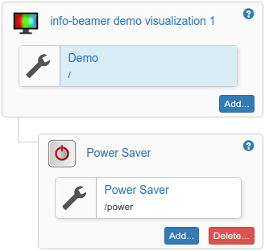

# Power Saver package

Very simple power saving example code. Just add this package
to your existing setup and it will automatically power off
your screen according its configuration.

# Adding this package to your existing setups

First of all you have to install this package. The easiest
way is probably to visit the package gallery, select the
package and click on __Import package__ in the top
right corner. Then go to any of your existing setups. It might
look like this:

Click on the __Add..__ button. A dialog will open:

Give your added package a name. Using the name 
__power__ is a good idea. Then click on the __Add__
button next to the power package.

Your setup configuration screen will now look like this. As
you can see the _Power Saver_ package was added as a child
Package to your existing package. Now it's time to customize
the _Power Saver_ options. Click on the wrench symbol next to
the Power Saver button. The interface will show you the
options for that package:

Select your time zone. Then mark each hour of each weekday.
Clicking will toggle between **red** (the screen of your
device will be turned off) and **green** (the screen will
be active). You can keep holding your left mouse button
to switch multiple hours at once.

# Offline

This package will not work offline if the device does not
have a correct system time, as it's impossible to turn the
display on/off according to the set schedule. The device
needs at least NTP access to work.
The screen will be turned on until the device managed to
fetch a somewhat correct system time
